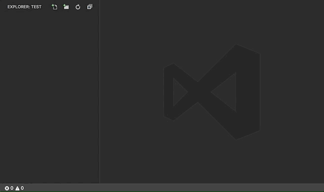
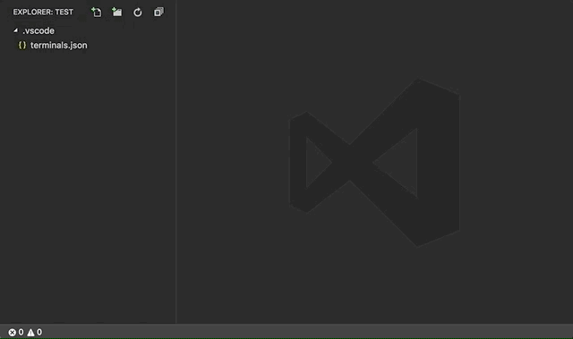

# Terminals Manager

<p align="center">
  
</p>

An extension for setting-up multiple terminals at once, or just running some commands.

The extension is configured using a very easy to edit JSON file.

Check the demo below to learn more.

## Install

Follow the instructions in the [Marketplace](https://marketplace.visualstudio.com/items?itemName=fabiospampinato.vscode-terminals), or run the following in the command palette:

```shell
ext install fabiospampinato.vscode-terminals
```

## Usage

It adds 4 new commands to the command palette:

```js
Terminals: Edit Configuration // Open the configuration file, it will create it for you if needed
Terminals: Kill // Kill all the terminals
Terminals: Run // Run all the terminals
Terminals: Run Single // Select a single terminal to run
```

It adds 1 shortcut:

```js
'Cmd/Ctrl+Alt+T' // Triggers `Terminals: Run Single`
```

## Settings

```js
{
  "terminals.invertCommandsAndDescription": false, // Invert a terminal commands and description in the quickpick
  "terminals.showCommands": false, // Show terminals' commands in the quickpick
  "terminals.showDescriptions": true, // Show terminals' descriptions in the quickpick
  "terminals.sortTerminals": false, // Sort terminals alphabetically
  "terminals.env": {}, // Global environment variables that will be applied to all terminals
  "terminals.multiplexer": "screen" // The terminal multiplexer to use for persistent terminals, supported values are: "screen", "tmux"
}
```

## Configuration

Run the `Terminals: Edit Configuration` command to create the configuration file. By default it uses a file named `terminals.json` under the `.vscode` directory, you can change this by supplying a custom path using the `terminals.configPath` setting entry.

The configuration is an object that looks like this:

```js
{
  "autorun": true, // Execute `Terminals: Run` automatically at startup or when the project is added to the workspace
  "autokill": true, // Kill all the terminals created from this configuration when the project is removed from the workspace
  "env": { "name": "value" }, // Global environment variables that will be applied to all terminals
  "terminals": [ // Array of terminals to open
    { // An object describing a terminal, most entries are optional

      "name": "My Terminal", // The name of the terminal, it will be displayed in the dropdown
      "description": "A terminal that runs some commands", // The description of the terminal
      "icon": "code", // An icon to show next to the name
      "cwd": "/Users/fabio/Desktop", // A path for the current working directory to be used for the terminal
      "command": "whoami", // Single command to run
      "commands": [ // Multiple commands to run
        "cd to/my/chest",
        "touch my_heart"
      ],

      "target": "My Other Terminal",// Execute the commands in this terminal's instance
      "persistent": "unique_session_name", // Keep the process running even when closing the terminal and reuse it, preservig the output. The unique session name will be passed to the terminal multiplexer
      "substitution": false, // Disable variable substitution for this terminal
      "recycle": false, // Always create a new terminal
      "open": true, // Open the terminal after executing its commands
      "focus": true, // Open the terminal after executing its commands and focus to it
      "execute": false, // Write the last command without executing it

      "onlySingle": true, // Don't run this with the `Terminals: Run` command
      "onlyMultiple": true, // Hide it from the `Terminals: Run Single` command
      "onlyAPI": true, // Don't run this with the `Terminals: Run` command and hide it from the `Terminals: Run Single` command

      "shellPath": '/bin/bash', // Path to a custom shell executable
      "shellArgs": ["--foo"], // Arguments to pass to the shell executable
      "env": { "name": "value" }, // Environment variables that will be applied to this terminal
      "envInherit": false // Don't inherit global environment variables

    }
  ]
}
```

Environment variables are expected to be strings.

You can also define terminals in your Visual Studio Code settings file under the key `terminals.terminals`. This way you can have global terminals, which are always available, while still having the ability to add some project-specific terminals in your configuration file.

## Persistent Terminals

Persistent terminals are achieved by saving sessions, and reattaching to them, using your [terminal multiplexer](https://en.wikipedia.org/wiki/Terminal_multiplexer) of choice.

The currently supported terminal multiplexers are [GNU Screen](https://en.wikipedia.org/wiki/GNU_Screen) and [tmux](https://en.wikipedia.org/wiki/Tmux).

You must have the terminal multiplexer setted in the `terminals.multiplexer` setting installed in your system for this to work:
  - **Linux/macOS**: your system probably comes with both `screen` and `tmux` installed by default.
  - **Windows**: you can install them via [cygwin](http://www.cygwin.com) or [WSL](https://en.wikipedia.org/wiki/Windows_Subsystem_for_Linux).

**Note**: a terminal multiplexer usually modifies the way a terminal work. For instance `ctrl+a` usually means "go to the beginning of the line" inside a terminal, but inside `screen`, `ctrl+a` doesn't work this way. You might want to configure your terminal multiplexer to best suit your needs.

**Note**: this is an experimental feature, you may encounter some bugs.

## Variable Substitution

This extension supports some special tokens that you can put in your configuration, they will be substituted with the appropriate value when you execute the terminal. This is especially useful for defining global terminals. Here they are:

| Token                       | Value                                                                                  |
|-----------------------------|----------------------------------------------------------------------------------------|
| `[workspaceFolder]`         | The path of the workspace folder that contains the active file                         |
| `[workspaceFolderBasename]` | The name of the workspace folder that contains the active file without any slashes (/) |
| `[file]`                    | The current opened file                                                                |
| `[relativeFile]`            | The current opened file relative to the workspace folder containing the file           |
| `[fileBasename]`            | The current opened file's basename                                                     |
| `[fileBasenameNoExtension]` | The current opened file's basename without the extension                               |
| `[fileDirname]`             | The current opened file's dirname                                                      |
| `[fileExtname]`             | The current opened file's extension                                                    |
| `[cwd]`                     | The current working directory on startup                                               |
| `[lineNumber]`              | The current selected line number in the active file                                    |

## Demo

#### Edit Configuration + Run



#### Run Single



### Persistent


## Hints

- **[Commands](https://marketplace.visualstudio.com/items?itemName=fabiospampinato.vscode-commands)**: Use this other extension, the `terminals.runTerminalByName` command and, optionally, the `onlyAPI` configuration option to create terminals that can be run with a click from the statusbar.
- **Self-destroying terminals**: it's a common use case to run some commands and then close the terminal, to do this simply put an `exit 0` command at the end of your commands list.
- **Icons**: [here](https://octicons.github.com/) you can browse a list of supported icons. If for instance you click the first icon, you'll get a page with `.octicon-alert` written in it, to get the string to use simply remove the `.octicon-` part, so in this case the icon name would be `alert`.

## Contributing

If you found a problem, or have a feature request, please open an [issue](https://github.com/fabiospampinato/vscode-terminals/issues) about it.

If you want to make a pull request you can debug the extension using [Debug Launcher](https://marketplace.visualstudio.com/items?itemName=fabiospampinato.vscode-debug-launcher).

## License

MIT © Fabio Spampinato
